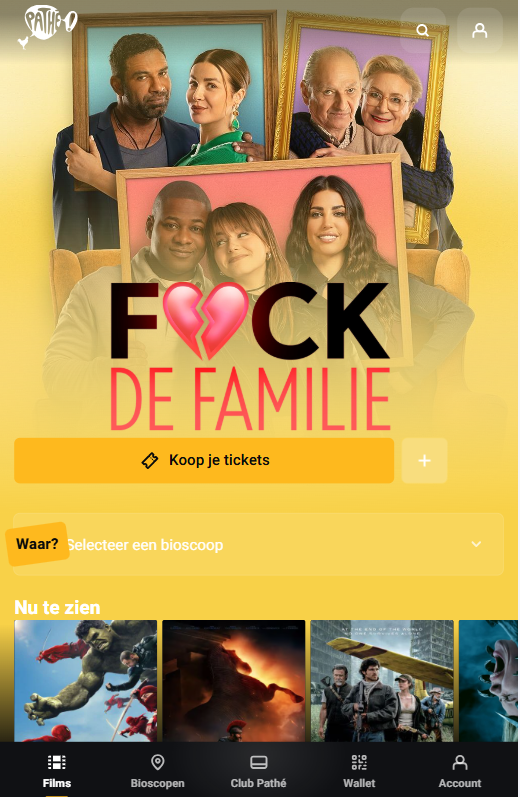
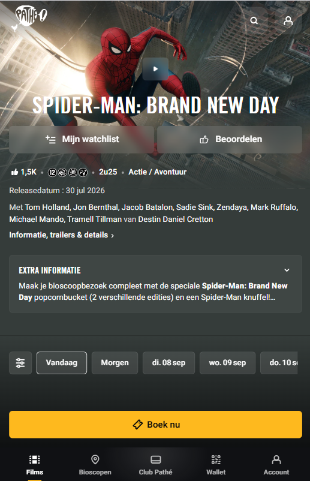
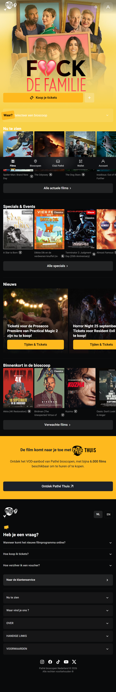
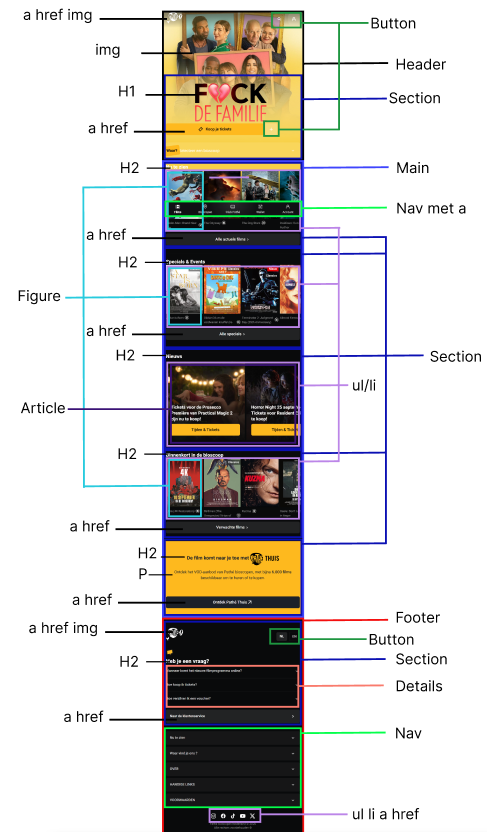
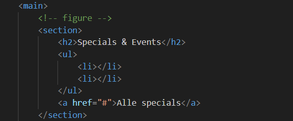
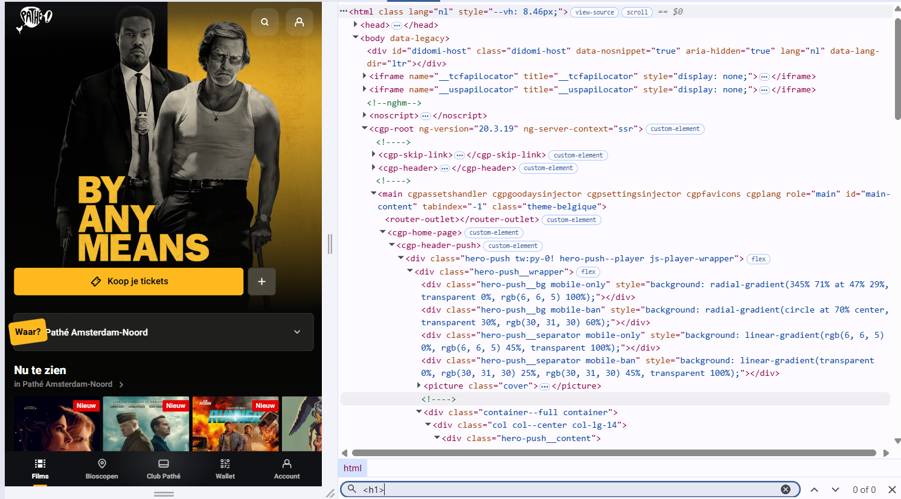
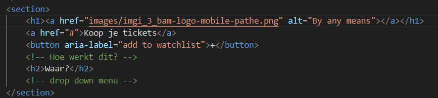

# Procesverslag
Markdown is een simpele manier om HTML te schrijven.  
Markdown cheat cheet: [Hulp bij het schrijven van Markdown](https://github.com/adam-p/markdown-here/wiki/Markdown-Cheatsheet).

Nb. De standaardstructuur en de spartaanse opmaak van de README.md zijn helemaal prima. Het gaat om de inhoud van je procesverslag. Besteedt de tijd voor pracht en praal aan je website.

Nb. Door *open* toe te voegen aan een *details* element kun je deze standaard open zetten. Fijn om dat steeds voor de relevante stuk(ken) te doen.

## Jij

  
uitwerken voor kick-off werkgroep

  ### Auteur:
  Caspar Euwes

  #### Je startniveau:
  Blauw

  #### Je focus:
  Responsive
 

## Je website

  
uitwerken voor kick-off werkgroep

  ### Je opdracht:
  (https://www.pathe.nl/nl)

  #### Screenshot(s) van de eerste pagina (small screen): 
  Home page
  

  #### Screenshot(s) van de tweede pagina (small screen):
  Movie page
  
 

## Toegankelijkheidstest 1/2 (week 1)

  
uitwerken na test in 2e werkgroep

  ### Bevindingen
  Lijst met je bevindingen die in de test naar voren kwamen:

## Breakdownschets (week 1)

  
uitwerken na afloop 3e werkgroep

  ### de hele pagina: 
  

  ### dynamisch deel (bijv menu): 
  

  ### wellicht nog een dynamisch deel (bijv filter): 
  

## Voortgang 1 (week 2)

  
uitwerken voor 1e voortgang

  Had wat vragen over de html opstelling.

  ### Stand van zaken
  hier dit ging goed & dit was lastig (neem ook screenshots op van delen van je website en code)
  
  Home page van pathe heeft geen H1
  

  ### Agenda voor meeting
  samen met je groepje opstellen
  
  Ik was alleen, ik had wat vragen over mijn nav en waar het moest staan.

  ### Verslag van meeting
  hier na afloop snel de uitkomsten van de meeting vastleggen

  - maak 2 nav's voor verschillende scherm groote.
  - gebruik figure.
  - doe eerst section in de header.

## Voortgang 2 (week 3)

  
uitwerken voor 2e voortgang

  Heb nog wat korte vragen over delen van html en hoe ik het er goed uit kan laten zien met css.

  ### Stand van zaken
  
  
  

  ### Agenda voor meeting
  samen met je groepje opstellen

  Shadow rond mijn pagina, hoe ik de H2 in mijn header moet positioneren, main posters moet ik een sort van tag krijgen, lijn tussen sections hoort niet helemaal door te gaan.

  ### Verslag van meeting
  hier na afloop snel de uitkomsten van de meeting vastleggen

  - punt 1
  - punt 2
  - nog een punt
- ...

## Toegankelijkheidstest 2/2 (week 4)

  
uitwerken na test in 9e werkgroep

  ### Bevindingen
  Lijst met je bevindingen die in de test naar voren kwamen (geef ook aan wat er verbeterd is):

## Voortgang 3 (week 4)

  
uitwerken voor 3e voortgang

  ### Stand van zaken
  hier dit ging goed & dit was lastig (neem ook screenshots op van delen van je website en code)

  ### Agenda voor meeting
  samen met je groepje opstellen

  | student 1      | student 2          | student 3    | student 4        |
  | ---            | ---                | ---          | ---              |
  | dit bespreken  | en dit             | en ik dit    | en dan ik dat    |
  | en dat ook nog | dit als er tijd is | nog een punt | dit wil ik zeker |
  | ...            | ...                | ...          | ...              |

  ### Verslag van meeting
  hier na afloop snel de uitkomsten van de meeting vastleggen

  - punt 1
  - punt 2
  - nog een punt
  - ...

## Eindgesprek (week 5)

  
uitwerken voor eindgesprek

  ### Je uitkomst - karakteristiek screenshots:
  

  ### Dit ging goed/Heb ik geleerd: 
  Korte omschrijving met plaatjes

  

  ### Dit was lastig/Is niet gelukt:
  Korte omschrijving met plaatjes

  

## Bronnenlijst

  
continu bijhouden terwijl je werkt

  Nb. Wees specifiek ('css-tricks' als bron is bijv. niet specifiek genoeg). 
  Nb. ChatGpT en andere AI horen er ook bij.
  Nb. Vermeld de bronnen ook in je code.

  1. https://www.w3schools.com/css/css3_object-fit.asp
  2. https://css-tricks.com/snippets/css/a-guide-to-flexbox/
  3. https://imagecolorpicker.com/
  4. https://lucide.dev/icons/
  5. https://developer.mozilla.org/en-US/docs/Web/Accessibility/ARIA/Guides/Techniques
  6. https://developer.mozilla.org/en-US/docs/Web/HTML/Reference/Elements/figure
  7. 

