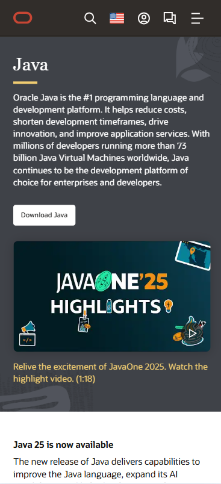

# Procesverslag
Markdown is een simpele manier om HTML te schrijven.  
Markdown cheat cheet: [Hulp bij het schrijven van Markdown](https://github.com/adam-p/markdown-here/wiki/Markdown-Cheatsheet).

Nb. De standaardstructuur en de spartaanse opmaak van de README.md zijn helemaal prima. Het gaat om de inhoud van je procesverslag. Besteedt de tijd voor pracht en praal aan je website.

Nb. Door *open* toe te voegen aan een *details* element kun je deze standaard open zetten. Fijn om dat steeds voor de relevante stuk(ken) te doen.

## Jij

  
uitwerken voor kick-off werkgroep

  ### Auteur:
  Caspar Euwes

  #### Je startniveau:
  Blauw

  #### Je focus:
  Responsiveness
 

## Je website

  
uitwerken voor kick-off werkgroep

  ### Je opdracht:
    https://www.oracle.com/

  #### Screenshot(s) van de eerste pagina (small screen): 
  https://www.oracle.com/  
  

  #### Screenshot(s) van de tweede pagina (small screen):
  https://www.oracle.com/java/  
  
 

## Toegankelijkheidstest 1/2 (week 1)

  
uitwerken na test in 2e werkgroep

  ### Bevindingen
  Lijst met je bevindingen die in de test naar voren kwamen:
  Html validation was slecht, er kwamen veel errors naar boven.
  Tijdens decive rotation waren er woorden van de pagina afgesneden als die er niet op paste en het logo werd erg klein.
  Voor de afbeeldingen was er een afbeelding met een alt attribute maar er stond niks in.

## Breakdownschets (week 1)

  
uitwerken na afloop 3e werkgroep

  ### de hele pagina: 
  

  ### dynamisch deel (bijv menu): 
  

  ### wellicht nog een dynamisch deel (bijv filter): 
  

## Voortgang 1 (week 2)

  
uitwerken voor 1e voortgang

  ### Stand van zaken
  hier dit ging goed & dit was lastig (neem ook screenshots op van delen van je website en code)
  Header staat er goed in en juiste kleuren erin gekregen, moet de margin van de body nog weghalen zodat de header geen witruimte heeft aan de bovenkant.
  

  ### Agenda voor meeting
  samen met je groepje opstellen

  | student 1          | student 2          | student 3    | student 4        |
  | ---                | ---                | ---          | ---              |
  |                    |                    |              |                  |
  |                    | geen vragen        |              |                  |
  |                    |                    |              | dit wil ik zeker |
  | ...                | ...                |              | ...              |

 Student 1: Vraag over form met button + input + popover element
            Footer tabbladen
            Aria-labels
            Herkleuren SVG iconen met CSS

  Student 2: Hamburger menu icoon kleiner krijgen en zonder achtergrond
            Welke sections kan ik het beste gebruiken
            Javascript naar css en html beter begrijpen
            Aria labels
            Article
            De rest bekijk ik morgen tijdens de uitleg

 Student 3: Nog geen vragen

 Student 4: Niks
 Student 5: Niks

  ### Verslag van meeting
  hier na afloop snel de uitkomsten van de meeting vastleggen

  - Geleerd hoe ik een caracel ik mijn website kan zetten.
  - Mocht een div gebruiken voor een deel van mijn website.

## Voortgang 2 (week 3)

  
uitwerken voor 2e voortgang

  ### Stand van zaken
  hier dit ging goed & dit was lastig (neem ook screenshots op van delen van je website en code)
Ik had op dit moment geen vragen omdat ik mijn website opnieuw aan het maken was (de html), omdat ik hier nog mee bezig was wist ik niet precies met welke delen ik zou vast lopen. Ik wou nog een vraag stellen over mijn caro maar ik loste het probleem zelf al op net voordat de les begon.

  ### Agenda voor meeting
  samen met je groepje opstellen

  | student 1      | student 2          | student 3    | student 4        |
  | ---            | ---                | ---          | ---              |
  | dit bespreken  | en dit             |              | en dan ik dat    |
  | en dat ook nog | dit als er tijd is |              | dit wil ik zeker |
  | ...            | ...                | ...          | ...              |

  Student 1: --
  Student 2: --
  Student 3: Caro
  Student 4: --
  Student 5: --

  ### Verslag van meeting
  hier na afloop snel de uitkomsten van de meeting vastleggen

  - Ik heb help gekregen met het goed opstellen van mijn hmtl, ik wist niet zeker welke delen ul waren.

## Toegankelijkheidstest 2/2 (week 4)

  
uitwerken na test in 9e werkgroep

  ### Bevindingen
  Lijst met je bevindingen die in de test naar voren kwamen (geef ook aan wat er verbeterd is): Mijn website was niet goed in staat om gestest te worden.

## Voortgang 3 (week 4)

  
uitwerken voor 3e voortgang

  ### Stand van zaken
  Ik had mijn code kapot gemaakt omdat ik in week 3 mijn html veranderde. Deze week heb ik hard gewerkt om mijn header met iconen goed te laten werken en een JS interactie te maken.

  ### Agenda voor meeting
  samen met je groepje opstellen

  | student 1      | student 2          | student 3    | student 4        |
  | ---            | ---                | ---          | ---              |
  | dit bespreken  | en dit             | en ik dit    | en dan ik dat    |
  | en dat ook nog | dit als er tijd is | nog een punt | dit wil ik zeker |
  | ...            | ...                | ...          | ...              |

  ### Verslag van meeting
  hier na afloop snel de uitkomsten van de meeting vastleggen

  - punt 1
  - punt 2
  - nog een punt
  - ...

## Eindgesprek (week 5)

  
uitwerken voor eindgesprek

  ### Je uitkomst - karakteristiek screenshots:
  

  ### Dit ging goed/Heb ik geleerd: 
  Korte omschrijving met plaatjes

  

  ### Dit was lastig/Is niet gelukt:
  Korte omschrijving met plaatjes

  

## Bronnenlijst

  
continu bijhouden terwijl je werkt

  Nb. Wees specifiek ('css-tricks' als bron is bijv. niet specifiek genoeg). 
  Nb. ChatGpT en andere AI horen er ook bij.
  Nb. Vermeld de bronnen ook in je code.

  1. bron 1
  2. bron 2
  3. ...

